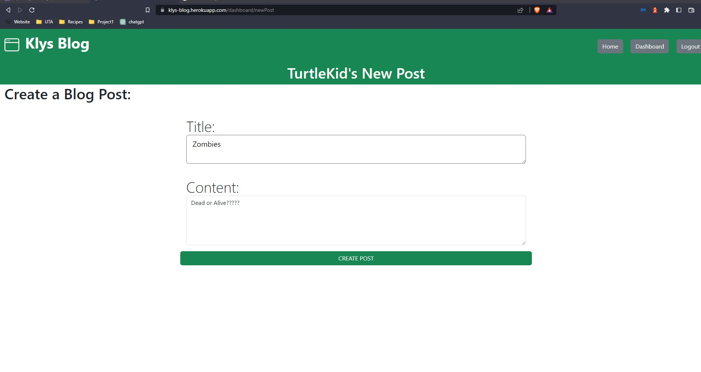

# **Module14_BlogMVC**

## Description
####  Blog with node.js modules express-handlebars, express-session, connect-session-sequelize, sequelize, mysql2, dotenv, bcrypt, and hosted on heroku

## Table of Contents: 
#### [Description](#description)
#### [Installation](#installation)
#### [Usage](#usage)
#### [ScreenShot](#screenshot)
#### [License](#license)
#### [Questions](#questions)

## Installation
### npm -i and set up a .env you clone repository or
### visit the heroku deployment https://klys-blog.herokuapp.com/login
## Usage
### visit https://klys-blog.herokuapp.com/login or you will need to create an account though to access anything(password must be 8 characters long)
### once logged in you can create a new post, edit or delete your own posts, and comment on other posts
### editing creating and deleting can only be done on your dashboard to your posts
### to view all posts go to the homepage
### to read a post or comment on a post click the grey title banner

## Screenshot
### 
### 
### 
### 
### 
### 

## License
### The MIT License   
#### https://www.mit.edu/~amini/LICENSE.md

## Questions
#### Github Profile: https://github.com/KlyDesign

